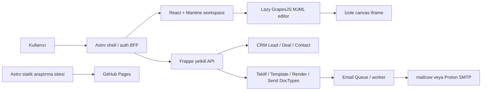

# Headless frontend mimarisi

Durum: araştırmaya dayalı öneri, 6 Ekim 2026. UI estetiği kararları ürün için kilitlenmez; burada kullanıcı yolculuğu ve teknik sınırlar tanımlanır.

## Dağıtımın iki yüzü

Public dokümantasyon: Astro static output → GitHub Pages `/crmail/`. Auth, secret, müşteri veri API'si ve gönderen SMTP hesabı bulunmaz. Ayrı authenticated ürün: Astro server adapter/BFF + React workspace → Frappe custom app/API. GitHub Pages backend veya SMTP worker çalıştırmaz. [Astro on-demand](https://docs.astro.build/en/guides/on-demand-rendering/), [Pages deployment](https://docs.astro.build/en/guides/deploy/github/).

Astro frontend “her etkileşim için yeni island” değildir. Workspace tek React ağacıdır; MantineProvider, QueryClientProvider, form state ve dialog root bunun içindedir. Statik giriş/help/docs Astro'da kalır. Rota sahibi PoC ADR'sinde seçilir: Astro page navigation veya `/app/*` client Router; aynı navigation'a iki history sahibi atanmaz. [Islands](https://docs.astro.build/en/concepts/islands/), [Provider](https://mantine.dev/theming/mantine-provider/).

## CRM entegrasyon seçenekleri

| Seçenek | Fayda | Bedel | Öneri |
|---|---|---|---|
| CRM'den Crmail route'a deeplink | Upgrade'e daha dayanıklı, bağımsız React shell | Bağlamı API ile taşımak gerekir | Pre-MVP varsayılan |
| CRM Vue detayında iframe Crmail editor | CRM içinde iş akışı görünür | Auth/cookie/CSP/height/focus/postMessage | PoC kanıtıyla MVP |
| CRM fork, tüm ekranları React'e port | Tek görsel kabuk | Sürekli upstream birleştirme, çok geniş kapsam | İlk sürüme alma |

CRM kaynak frontend'inin Vue oluşu resmi [manifestte](https://github.com/frappe/crm/blob/develop/frontend/package.json) görülebilir. “CRM'e gömülü” ile “native Vue component” aynı kabul edilmez. Backend headless şartı kullanıcının operasyonel akışında Desk gerektirmemek olarak uygulanır; Frappe admin/migration araçlarının tamamen silinmesi hedeflenmez.

## Editor adapter sözleşmesi

React sadece host element, toolbar ve domain commands sahibi. GrapesJS kendi panel/canvas/component DOM'unun sahibi; React bu DOM'u her state güncellemesinde yeniden çizmez. Wrapper initialize idempotent, unmount `editor.destroy()`, observer/listener/abort-controller cleanup sağlar. StrictMode double mount ve route geri/ileri bellek sızıntısı kontrol edilir. [Editor API](https://grapesjs.com/docs/api/editor.html).

1. Şablon açma: yetkili API revision+project JSON+MJML+versions döner.
2. Kullanıcı “Görsel düzenleyici” isterse dynamic import GrapesJS/plugin/compiler/CSS.
3. Host → editor `loadProjectData`; iki farklı truth source yaratılmaz.
4. Editör güncellemesi dirty state oluşturur; autosave revision compare-and-swap ile yazılır.
5. Çakışma: kullanıcının draft'ı silinmez; conflict dialog ve ayrı revision korunur.
6. Kaydetme: project JSON ve canonical MJML snapshot; server compile/validate.
7. Önizleme: server immutable render çıktısı sandboxed ayrı preview iframe'de; editor canvas teslim kanıtı değildir.
8. Gönderme: yetkili domain endpoint render id/revision + recipients + idempotency key alır; server final authorization ve approval kontrol eder.

GrapesJS storage default localStorage yerine Crmail authenticated remote storage adapter olur. Gizli müşteri içerikleri ortak cihazda kalıcı browser cache'e otomatik yazılmaz. Project JSON ve HTML birbirinin yerine kullanılmaz. [Storage](https://grapesjs.com/docs/modules/Storage.html).

Plugin varsayılan theme ve global `.gjs-*` stil enjekte edebilir. `useCustomTheme:false` ile paket seçeneklerini incele; kendi editor tokens host scope içinde uygulanır. Editor görünümünü ezmeden yalnız domain toolbar, block labels, markalı template içerikleri ve gerekli erişilebilirlik düzeltmeleri eklenir. Plugin options `resetBlocks/resetStyleManager/resetDevices` etkileri ayrı değerlendirilir. [Plugin kaynak](https://github.com/GrapesJS/mjml/blob/master/src/index.ts).

## 320px kritik yolculuk

İlk kabul: müşteri seç → teklif/şablon aç → metin değiştir → buton ekle → görsel ekle → blok sırasını değiştir → kaydet → önizle → alıcı/subject kontrol → gönderim onayı. Dar ekranda masaüstü üç paneli küçültme. İçerik outline ve seçili blok property sheet ana akış; geniş canvas ayrı önizleme; “yukarı/aşağı taşı” klavye/dokunma alternatifi. Drag, hover veya küçük iframe handles tek erişim yolu olmaz.

Seçili blok/property state ile gerçek GrapesJS component modelleri aynı revision'a bağlı olur. Telefon basit blok düzenleme kabuğu farklı içerik engine değildir. Rich desktop canvas yalnız gereken route/eylemde indirilir. Mobil özelliklerin gerçek plugin API ile uygulanabilirliği PoC kapısıdır; hazır tam mobil destek iddiası yoktur.

320 →360→375→390→yatay telefon→tablet→desktop. Layout width, height, pointer, hover, keyboard ve kullanıcı tercihleri ayrı değerlendirilir; `isMobile`/UA ayrımı yapılmaz. Girilen metin, focus ve açık property panel resize/rotation'da korunur. Reduced motion ve zoom için token/transition kararları bulunur. Görünür kontrol ve dokunma alanı ayrı token; coarse pointer'da 48px hedef başlangıç önerisidir, ürün araştırmasıyla kesinleşir.

## UI fikirleri: karar değil

Teklifte “taslak / onay bekliyor / gönderildi” durum akışı, editor'de blok outline, sağda bağlamsal properties, mobilde sheet, gönderimde alıcı + subject + immutable preview tek kontrol adımı. Semi-flat2.0 ifadesi bu projede estetik brief'tir; resmi teknik standard veya erişilebilirlik uygunluğu olarak sunulmaz. Az gölge, yüzey hiyerarşisi, sınırlı radius ve markalı vurgu seçenekleri prototip önerisidir. Ürün paleti/tipografisi/density kullanıcı incelemesi öncesi kesin karar sayılmaz.

Mantine varsayılan estetiği ürün kimliği yerine geçmez. Semantik tokens: surface/text/accent/focus/status, typography, spacing, control size/hit area, radius/shadow/layer. Mantine theme ve email brand tokens aynı domain kaynaktan türeyebilir; web CSS ve e-posta çıktı CSS aynı uygulanabilirlik kurallarına sahip değildir. [Mantine styles](https://mantine.dev/styles/mantine-styles/).

## UX kabul ve API hataları

Dirty navigation guard, offline/save-pending, session-expired, attachment-processing, merge-field-missing, server-compile-error ve send-status-unknown ayrı durumlar. Client gönderildi demeden server send job receipt bekler; SMTP accepted, delivered, opened ayrı durumlar. Tekrar gönderirken önce aynı idempotency receipt sorgulanır. Header/URL'de kullanıcı secret'ı, full mail body veya kişisel veri loglanmaz.

Kopyala HTML+plain text'i browser clipboard'a yazar; buton yalnız user gesture/HTTPS altında başarıyla sonuçlandığında kopyalandı der. Mail uygulamasının HTML sanitizasyonu nedeniyle copy/paste birebir teslim yöntemi kabul edilmez; doğrudan gönderim ana yolculuktur. [Clipboard](https://developer.mozilla.org/en-US/docs/Web/API/Clipboard/write).
