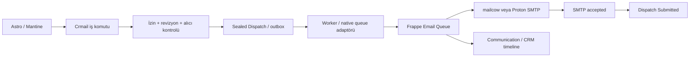

# E-posta iletimi: Frappe, mailcow ve Proton

Tarih: 6 Ekim 2026. Bu belge iletim tasarımı ve kaynak incelemesidir; hiçbir hesaba bağlanılmadı, dış alıcıya e-posta gönderilmedi. SMTP sağlayıcısı ile Frappe Framework birbirinin alternatifi değildir: Frappe taslak/işlem/kuyruk yönetir; SMTP provider iletir. “Frappe suite ile gönder” için ayrı Frappe Mail ürünü zorunlu değildir.

## Gönderim yolu

Browser SMTP konuşmaz; SMTP secret yalnız sunucudadır. UI kullanıcı kimliğiyle `request_dispatch` çağırır; API kontrol edip aynı gönderim intent'ini idempotency key ile tekilleştirir. Native Framework `sendmail`, `Email Account` ve `Email Queue` tekrar kullanılabilir. Kaynak: [sendmail v16.50.0](https://github.com/frappe/frappe/blob/v16.50.0/frappe/email/__init__.py), [Email Queue](https://github.com/frappe/frappe/blob/v16.50.0/frappe/email/doctype/email_queue/email_queue.py).

## Sağlayıcı karşılaştırması

| Konu | mailcow | Proton SMTP Submission |
|---|---|---|
| SMTP | Mail server hostname;465 TLS veya587 STARTTLS | smtp.protonmail.ch:587 STARTTLS; SMTP token |
| Gelen kutusu | IMAP993 TLS | Submission yalnız gönderim; doğrudan IMAP değildir |
| Sent klasörü | SMTP tek başına klasöre kopya işlemi değildir; Frappe IMAP append seçeneği kullanılabilir | Proton SMTP gönderileri Sent'e koyar |
| Frappe incoming sync | IMAP ayrı ayarlanabilir | Gerekirse Bridge ayrı operasyon; garanti olmayan entegrasyon |
| Operasyon | Sunucu, DNS, TLS, spam/reputation, backup sorumluluğu | Ücretli plan + custom domain SMTP hakkı, token yönetimi |
| MVP kararı | Mevcut kurulu mailcow varsa ilk aday | Uygun Proton planı varsa doğrudan submission ile outbound aday |

Kaynak: [mailcow manual config](https://docs.mailcow.email/client/client-manual/), [Proton SMTP](https://proton.me/support/smtp-submission), [Frappe Sent append code](https://github.com/frappe/frappe/blob/v16.50.0/frappe/email/doctype/email_account/email_account.py).

İki sağlayıcı aynı anda ilk sürüme zorunlu değildir. Provider-neutral UI ve server account mapping tasarlanır; ilk gerçek provider PoC'de seçilir. Failover otomatik SMTP tekrar gönderme değildir: ilk sağlayıcı kabul etmiş olabilir. Connector değişimi yalnız outcome biliniyorsa veya kullanıcı belirsizliği kabul ederek yeni dispatch oluşturursa yapılır.

Proton submission ile gönderilen mesajlar end-to-end encrypted değildir; ürün bunu Proton markası nedeniyle otomatik şifreli yazışma olarak pazarlayamaz. SMTP token normal hesap şifresi değildir. Kaynak: [Proton SMTP security](https://proton.me/support/smtp-submission).

## Proton inbound sınırı

Bridge yerel IMAP/SMTP sağlar, ücretli hesap gerektirir ve Linux'ta secret-service veya Pass gibi credential store ihtiyacı vardır. Resmî desteklenen istemciler arasında Frappe belirtilmiyor; Linux'ta Thunderbird aktif test edilir. Dolayısıyla “Frappe + Proton inbox sync hazır ve destekli” denemez. Kaynak: [Bridge Linux](https://proton.me/support/bridge-for-linux), [supported clients](https://proton.me/support/clients-supported-bridge), [local loopback security](https://proton.me/support/bridge-ssl-connection-issue).

Öneri: MVP outbound-only. Inbound gerekirse post-MVP ayrı PoC: daemon lifecycle, account logout, keyring erişimi, loopback TLS trust, cache/backup, connection loss ve thread dedup. Bridge yerel servisi internete expose edilmez; üretim sunucusuna erişim ayrıştırılır. Mevcut kullanıcının GUI/desktop hesabı üstüne arka planda bağımlılık kurmak ürün altyapısı değildir.

## HTML, MJML, MIME ve snapshot

Kaynaklar ayrı tutulmalı:

- **Editor project JSON:** tekrar açılabilir düzenleme modeli.
- **MJML:** açık şablon kaynağı ve server compiler girdisi.
- **Compiled HTML + text/plain:** e-posta sunum çıktısı.
- **Asset manifest:** File IDs, MIME type, checksum, alt text, transport strategy.
- **Final MIME snapshot/hash:** gerçekten kuyruğa verilen mesajın kanıtı.

Öneri: server MJML compiler seçilen sürümde çalışır, resource limit ve timeout uygular. Browser derlemesi hızlı önizlemedir; gönderim otoritesi server çıktısıdır. Frappe'nin native mail pipeline'ı compiled HTML'yi wrapper/CSS/Jinja ile yeniden işleyebilir. `sendmail` varsayılan `raw_html=False`, `add_css=True`; EmailBody `raw_html=True` yolunda tekrar `render_template` çağırır. `Communication.make` ayrıca raw HTML için native şablonun Use HTML ayarını kontrol eder. Bu yüzden flags'i körlemesine açmak yeterli değildir. Kaynak: [sendmail parametreleri](https://github.com/frappe/frappe/blob/v16.50.0/frappe/email/__init__.py), [HTML rendering](https://github.com/frappe/frappe/blob/v16.50.0/frappe/email/email_body.py), [Communication gate](https://github.com/frappe/frappe/blob/v16.50.0/frappe/core/doctype/communication/email.py).

PoC'de üç seçenek karşılaştırılır: native raw HTML uyumlu adapter, kontrollü app wrapper, gerekirse yalnız format aşamasını değiştiren dar hook. Çıkış ölçütü final MIME'ın approved içerik ve linkleri korumasıdır. Fork veya patch varsayılan değildir. Özel mail sender hook'u düşünülürse native Queue status/retry/Sent davranışından ne kadarını üstlendiği açık yazılır. Template interpolation yalnız tanımlı escaped alanlara izin verir; müşteri metni/agent üretimi arbitrary Jinja olarak çalıştırılmaz.

### Görsel iletimi

Base64 data URI local HTML preview/copy için kullanılabilir; bütün email istemcilerinde destek garantisi verilemez. Gönderim için kurumsal küçük logo/görseller **CID MIME related** adayıdır; public marka asset'leri HTTPS adayı olabilir. Private teklif görselini public URL'ye çevirmek yasaktır. CID de “bütün Outlook sürümleri kusursuz” garantisi değildir; hedef istemci testleri gerekir.

Framework `email_body.py` inline attachment `Content-ID`, `inline=True`, multipart/related ve `embed` → `cid` dönüşümü içeriyor. Native parametre shape'i `inline_images` için `filename`/`filecontent`; attachments için `fname`/`fcontent`. Nodemailer parametrelerini Frappe'ye aynen geçirmek doğru değildir. Kaynak: [MIME implementation](https://github.com/frappe/frappe/blob/v16.50.0/frappe/email/email_body.py).

Asset'ler kullanıcı tarafından File ID üzerinden seçilir; sunucu belge ve File read iznini, content type, boyut, origin ve referansı doğrular. Private authenticated URL e-posta alıcısında login olmadan görünmez; dosyayı authorized bytes olarak CID/PDF eki taşı veya süreli alıcı-kapsamlı indirme linki tasarla. Backend serbest URL'den görsel fetch ederse SSRF, local file path okursa path traversal sınırı açılır; arbitrary path/URL kabul edilmez. Kaynak bağlamı: [File permissions](https://github.com/frappe/frappe/blob/v16.50.0/frappe/core/doctype/file/file.py).

### Clipboard farklı transport

CID referansı panodan Proton/Outlook composer'a yapışınca MIME eki kendiliğinden yaratmaz. Bu nedenle Kopyala çıktısı gönderim MIME'ından ayrıdır: uygun HTTPS public marka görseli veya istemci izin verirse data URI; private içerik için metin/link fallback. Kullanıcıya “copy” başarısı gönderim doğrulaması diye gösterilmez. Gönder düğmesi panoya bağımlı değildir.

## İzin, alıcı ve sender politikası

`From` yalnız hesabın yetkili identity/domain listesi içinden seçilir. Contact seçimi arbitrary To değerine dönüşmeden CRM belge okuma/sender izni kontrol edilir; dış alıcıya yazma ürün gereğiyse adres doğrulama + açık önizleme vardır. CR/LF header injection ve forbidden schemes bloklanır. CC/BCC sınırı görünür olmalı; native queue separately davranışında her To ile CC/BCC kopyaları oluşabileceği için MVP'de tek intent/sınırlı alıcı tercihi gerekir. Kaynak: [Queue separately implementation](https://github.com/frappe/frappe/blob/v16.50.0/frappe/email/doctype/email_queue/email_queue.py).

Gönderim approval'ı exact payload hash'e bağlıdır. Approval sonrası To, subject, CTA URL, PDF veya fiyat değişirse eski approval geçersizleşir. UI/MCP aynı iş komutunu kullanır; token/user permission sunucu tarafından yeniden değerlendirilir. Agent yalnız prompt'ta onay var dediği için işlem yapamaz.

## SMTP accepted ve duplicate problemi

Native queue SMTP `sendmail` çağrısı döndükten sonra recipient durumunu Sent olarak günceller. Worker bu iki adım arasında ölürse sağlayıcı kabul etmiş, DB kayıt güncellenmemiş olabilir. SMTP retry RFC'si tekrar gönderme gerektirebilir; Message-ID aynı olsa bile tüm alıcılar dedup yapmak zorunda değildir. Kaynak: [native boundary](https://github.com/frappe/frappe/blob/v16.50.0/frappe/email/doctype/email_queue/email_queue.py), [RFC5321 retry](https://www.rfc-editor.org/rfc/rfc5321).

İdempotency key **aynı UI/API isteğinin** ikinci dispatch üretmesini engeller; dış SMTP side effect için exactly-once sağlamaz. Önerilen ürün policy:

| Sonuç | Davranış |
|---|---|
| İzin/şema/asset hatası | Kuyruğa alınmaz; düzeltilebilir |
| SMTP açık 4xx, kabul öncesi | Sınırlı backoff, aynı intent |
| SMTP açık kalıcı5xx | Failed; otomatik tekrarlama yok |
| DATA sonrası timeout / bağlantı kesilmesi | UnknownSubmission; kabul log/provider kanıtı aranır |
| SMTP250 + DBdurumu | Submitted; inbox/delivery garantisi değil |
| SMTP başarı, IMAP Sent append hatası | Gönderiyi yeniden gönderme; ayrı Sent copy sorunu |

**En kritik PoC kapısı:** native Frappe retry policy ile UnknownSubmission policy nasıl uzlaştırılacak? Native Sending recovery yeniden deneme yapabilir. Yalnız Dispatch'e Unknown yazıp Queue'nun otomatik retry etmesine izin vermek vaat edilen güvenliği sağlamaz. PoC'de source-level retry adapter/hook sınırı seçilmeli, native Queue tekrarları gerektiğinde durdurulmalı ve operator reconciliation tasarlanmalı. Bu çözüm burada uygulanmadı; unresolved blocker olarak korunur. Kaynak: [retry_sending_emails](https://github.com/frappe/frappe/blob/v16.50.0/frappe/email/queue.py).

## Takip ve teklif bağlantıları

Threading Message-ID / In-Reply-To ile bağlanır; konu eşleşmesi tek başına yeterli değildir. Aynı mesajın incoming import'u unique message/provider event ile tekilleştirilir. SMTP DSN desteği provider capability'sine bağlıdır; native code extension varlığını kontrol eder. “Okundu” pikseli güvenilir kişi eylemi değildir ve müşteri mahremiyet politikası olmadan eklenmez. Kaynak: [Queue DSN](https://github.com/frappe/frappe/blob/v16.50.0/frappe/email/doctype/email_queue/email_queue.py), [sendmail threading](https://github.com/frappe/frappe/blob/v16.50.0/frappe/email/__init__.py).

Teklif GET linki yalnız görüntüler; mail security scanner/prefetch kabul tetikleyemez. Accept için açık POST, exact revision, expiry, tek kullanımlı/replay güvenli token veya kullanıcı kimliği gerekir. Elektronik kabul hukuki e-imza garantisi değildir; kapsam ve mevzuat ayrıca değerlendirilir.

## İşletim devri

Hüseyin Cengiz: SMTP/TLS gereksinimi, sender/domain policy, outbound connectivity, worker/scheduler, backup/restore, log/alert ve rollback teknik planı. Asistan Hüseyin: GoDaddy DNS kayıtlarını Hüseyin Cengiz'in verdiği kayıt türü/adı/değeriyle uygular. Kabul: TLS bağlantı sonucu, SPF/DKIM/DMARC doğrulaması, fake sink + yetkili staging received MIME, mailcow Sentcopy veya Proton Sent davranışı. Bu görev paylaşımı mesaj gönderme/server değişikliği yetkisi değildir.

Mac geliştirme ortamı Colima factory; çalışan servisler yeniden başlatılmaz. Üretim Hetzner/Debian ise Docker Engine kapsamı ayrı. Repo public olabilir; SMTP secrets, Email Account export'ları, gerçek CRM kişiler, MIME/personal PDF, backup veya `.env` repoya girmez.

## PoC/MVP test corpus'u

1. Türkçe ad ve uzun konu; iki CTA, iki image, private PDF; HTML + plain MIME.
2. Expired session ve forbidden sender; iki kullanıcı File isolation.
3. Çift click, same key/same payload; same key/different payload conflict.
4. Commit→enqueue crash; reconciler duplicate queue üretmiyor.
5. SMTP DATA250 kaybı, worker kill; native auto-retry policy uyumu kanıtlanıyor.
6. SMTPaccepted + Sentappend failure; mail tekrar gönderilmiyor.
7. Published template/draft daha sonra değişiyor; eski submitted MIME aynı kalıyor.
8. Outlook classic/new, Proton web, Apple Mail/Gmail hedef matrisi; gerçek istemci proof ayrı.
9. Backup restore isolated, outbound muted; queue yanlışlıkla yeniden gönderilmiyor.

Hepsi planlanmıştır; araştırma sırasında çalıştırılmadı.
